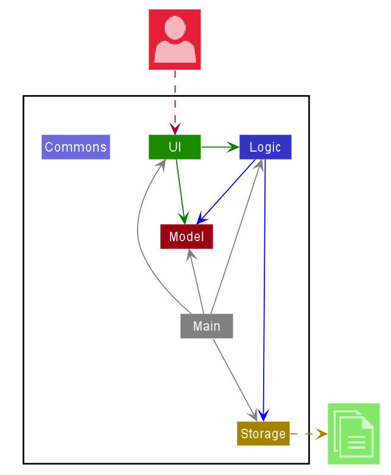

# iGraduate study helper
By: `W09-2` Latest update: `22 March 2021`

- [iGraduate study helper](#igraduate-study-helper)
    * [1. Introduction](#1-introduction)
    * [2. Setting up, getting started](#2-setting-up-getting-started)
    * [3. Design](#3-design)
        + [3.1 Architecture](#31-architecture)
        + [3.2 UI component](#32-ui-component)
        + [3.3 Logic component](#33-logic-component)
        + [3.4 Model component](#34-model-component)
        + [3.5 Storage component](#35-storage-component)
        + [3.6 Common classes](#36-common-classes)
    
## 1. Introduction
iGraduate is a command line interface application written in Java. 
The iGraduate API allows students to add modules to take, edit, delete or 
mark these modules as done. Students can also calculate their CAP at any 
point of time and list modules added to the application.

## 2. Setting up, getting started

## 3. Design
{Describe the design and implementation of the product. Use UML diagrams and short code snippets where applicable.}

### 3.1 Architecture

The Architecture Diagram given above explains the high-level design of the App. Given below is a quick overview of each component.

## Design & implementation

iGraduate has one class called `iGraduate` which contains a main and run method and iGraduate constructor. 
It is responsible for:

- At app launch: Initialising the components in the correct sequence, and connects them up with each other.
- At shut down: Shuts down the components and invokes cleanup methods where necessary.

`Commons` represents a collection of classes used by multiple other components.

The rest of the App consists of four components:
- UI: The UI of the App.
- Logic: The command executor.
    - Parser - Understands and interprets the commands input by user, passes command to run to Command.
    - Command - Executes command based on what is parsed.
- Model: The user data held by the program
    - Module - Holds the information of individual modules.
    - ModuleList - Holds data of all modules of the app in memory.
- Storage: Reads data from, and writes data to, the hard disk.

Each of the four components,
defines its API in an interface with the same name as the Component.
exposes its functionality using a concrete {Component Name}Manager class (which implements the corresponding API interface mentioned in the previous point.

How the architecture interacts with each other [DIAGRAM]

### 3.2 UI Component

### 3.3 Logic Component

### 3.4 Model Component

### 3.5 Storage Component

### 3.6 Common classes

## Product scope
### Target user profile

{Describe the target user profile}

### Value proposition

This app will help NUS students majoring in information security check his/her graduation progress and modules taken in a coherent manner based on the programme requirements. It also contains tools to help make informed decisions about future modules.

## User Stories

|Version| As a ... | I want to ... | So that I can ...|
|--------|----------|---------------|------------------|
|v1.0|user|see the list of modules I can take now|decide on which modules to register|
|v1.0|user|clearly see which modules I have taken|to check my prerequisites|
|v1.0|user|delete mods that I have added|amend any typos|
|v1.0|user|add new modules that I have taken|track the modules I have taken|
|v1.0|user|utilise the CLI to input my information and execute functions||
|v1.0|user|have my data be persistent|access it again next time when I run the program|
|v1.0|impatient user|access information quickly||
|v1.0|lazy user|access information with as little effort as possible||
|v1.0|user|know my academic progress|estimate my pace and plan for the future|
|v2.0|careless user|know if the module I entered is valid||
|v2.0|user|calculate my current CAP||
|v2.0|user|know if the module I entered is valid|monitor my performance throughout the course of study|
|v2.0|user|see what modules I have already taken|plan what modules to take next semester|
|v2.0|forgetful user|know if I meet the prerequisites for computing modules I want to take||
|v2.0|user|edit the modules for the course|amend my mistakes or changes in module details|
|v2.0|user|be able to pick out any module as my UE||
|v2.0|user|know the pre-requisites of a module|plan my semesters better|
|v2.0|user|see all core modules I have to take||
|v2.0|user|be able to choose any electives of my course||

## Non-Functional Requirements

{Give non-functional requirements}

## Glossary

* *glossary item* - Definition

## Instructions for manual testing

{Give instructions on how to do a manual product testing e.g., how to load sample data to be used for testing}
